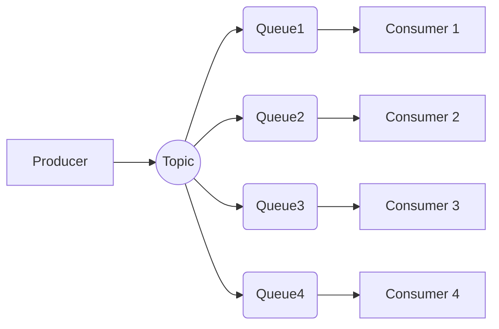

# redis-mb
**redis-mb** is a Message Broker based on Redis and Node.js.

# Concept
The main concept of **redis-mb** is *Virtual Topic*. A *Virtual Topic* is like a topic where the producer send a message and consumers receive a copy of the message on their own queue.

Here an example of a *Virtual Topic* with one Producer and four Consumers.

